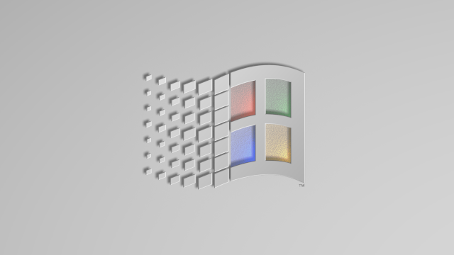
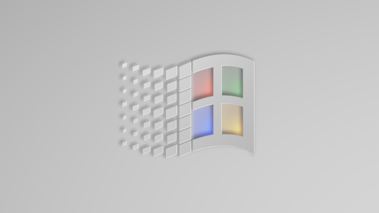
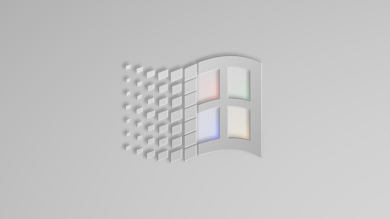
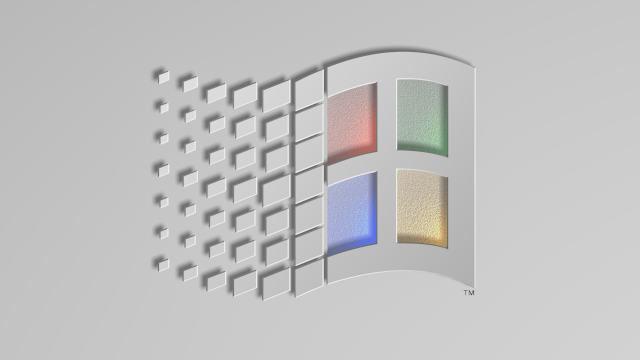

# Windows 98's style wallpapers
## setup.bmp
This wallpaper was inspired by 640x480 px one from MS Windows(R) 98 installation, and rebuilt from zero in blender3d modeling suite for 2K resolution.
### Medium size of logo
#### Standard

* [3840x2160 px.](setup.bmp/medium/3840x2160_0.png "3840x2160")
* [1920x1080 px.](setup.bmp/medium/1920x1080_0.png "1920x1080")
* [1024x768 px.](setup.bmp/medium/1024x768_0.png "1024x768")

#### Light blur with saturated color

* [3840x2160 px. blurry](setup.bmp/medium/3840x2160_light_blur_color_1.png "blurry")
* [3840x2160 px. blurrier](setup.bmp/medium/3840x2160_light_blur_color_2.png "blurrier")
* [3840x2160 px. blurriest (as on preview)](setup.bmp/medium/3840x2160_light_blur_color_3.png "blurriest")

#### Light blur (desaturated)

* [3840x2160 px. (smoother then preview)](setup.bmp/medium/3840x2160_light_blur_smooth.png "3840x2160 smooth contrast")
* [1920x1080 px.](setup.bmp/medium/1920x1080_light_blur.png "1920x1080")
* [1366x768 px.](setup.bmp/medium/1366x768_light_blur.png "1366x768")

### Large size of logo

* [3840x2160 px.](setup.bmp/medium/3840x2160.png "3840x2160")
* [1920x1080 px.](setup.bmp/medium/1920x1080.png "1920x1080")
* [1600x900 px.](setup.bmp/medium/1600x900.png "1600x900")
* [1536x864 px.](setup.bmp/medium/1536x864.png "1536x864")
* [1400x900 px.](setup.bmp/medium/1400x900.png "1400x900")
* [1366x768 px.](setup.bmp/medium/1366x768.png "1366x768")

### Old version (3840x2160 px.)

